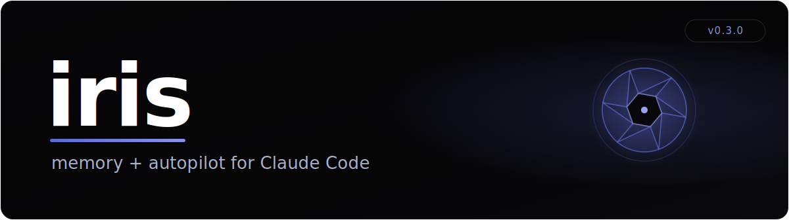
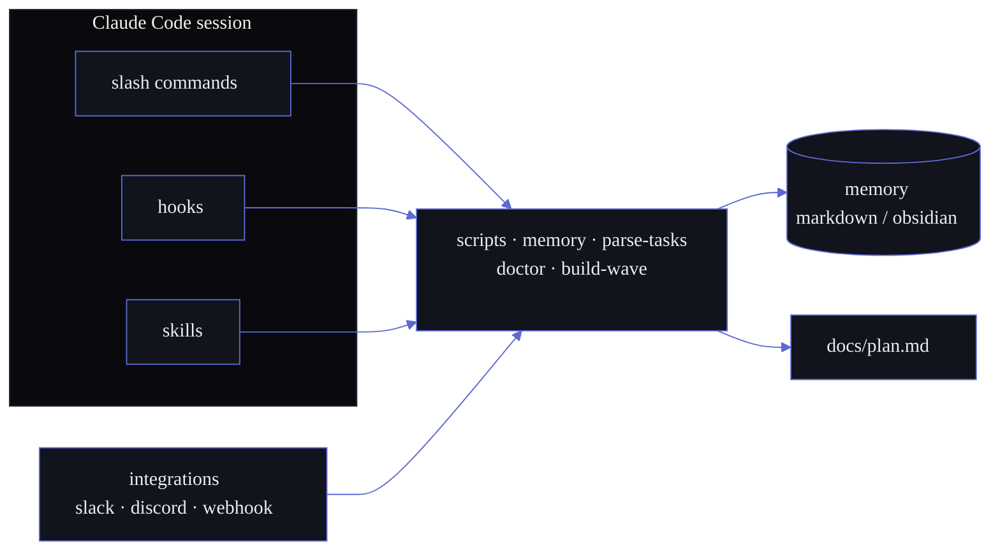
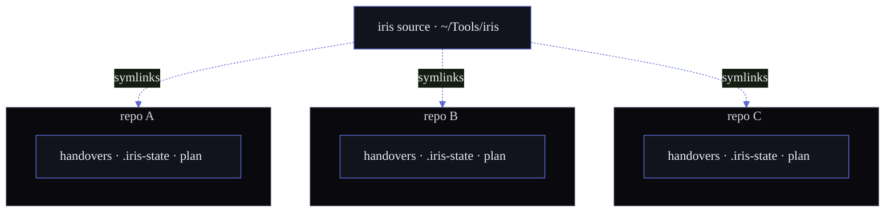

<p>
  <a href="LICENSE"></a>
  
  <a href="https://github.com/sohams25/iris/actions/workflows/ci.yml"></a>
  
  
  
</p>

A Claude Code session forgets everything when it ends. **iris is the layer that remembers** — and the one that connects the session to your backlog, your terminal, and your team's chat. Drop it into any project: persistent memory across sessions, a backlog-driven execution loop, parallel swarm waves, and a connect-to-anything integration shape. No daemon. Plain files you can grep.

```bash
git clone https://github.com/sohams25/iris.git ~/Tools/iris
cd <your-project> && bash ~/Tools/iris/setup.sh
```

---

## Architecture



## What you get

| | |
|---|---|
| **Memory across sessions** | A handover is written automatically when context compaction fires; `SessionStart` injects it at the top of the next session. Continuity without copy-paste. |
| **Backlog-driven execution** | `docs/plan.md` is a YAML backlog. `/run` works it serially — task → verify → commit → loop. `/swarm` fans file-disjoint tasks across parallel agent waves. |
| **Commit-message guard** | A `PreToolUse` hook hard-blocks `git commit` bodies carrying `🤖 Generated with Claude Code` / `Co-Authored-By: Claude` and similar. Your history stays human. |
| **Multi-project by default** | Every script roots its state at the project you're in. Run iris in a dozen repos at once — handovers, locks, and backlogs never cross. |
| **Connect to anything** | One adapter shape under `integrations/<name>/`. Slack ships; Discord, webhook, and email are documented stubs. |
| **Doctor** | 14 health checks (CLI, plan, hooks, settings, skill symlinks…) with a 0/1 exit — wire it into CI. |

## Commands

| Command | Does |
|---|---|
| `/status` | Open tasks · current handover · branch · last commits |
| `/backlog [Tnnn]` | The backlog as a table, or one task by id |
| `/submit <desc>` | Refine a raw idea into a `T###` entry in `docs/plan.md` |
| `/run` | Serial loop: next task → implement → verify → commit → repeat |
| `/swarm` | Parallel-wave execution (file-disjoint tasks only) |
| `/rollover [title]` | Manual handover checkpoint with carry-forward |
| `/memory [current\|list\|search\|validate]` | Inspect the memory backend |
| `/doctor` | Run the 14 health checks |
| `/new-task <slug>` | Scaffold `$PROJECTS_DIR/<N>_<slug>/` with README + docs/ + archive/ |

> `/plan` belongs to Claude Code's built-in plan mode — iris uses `/backlog`.

## Hooks

| Event | What it does |
|---|---|
| `SessionStart` | Reads `memory.py current` and injects the handover as a `## iris context` block |
| `PreCompact` | Writes the next handover (carry-forward) right before Claude compacts |
| `PreToolUse(Bash)` | Blocks `git commit`/`git tag` bodies that carry an AI signature — fails open on anything malformed |

All three are wrapped so a broken script never blocks your session.

## Memory

Two backends, one CLI. Switch with `MEMORY_BACKEND` in `.env`.

| Backend | Storage | For |
|---|---|---|
| `markdown` *(default)* | `handovers/handover_NNN.md` at repo root | Zero deps. Plain files. Grep-friendly. Isolated per project. |
| `obsidian` | `$OBSIDIAN_VAULT/work/handovers/<project>/` | Handovers searchable inside your vault, namespaced per project. |

`scripts/migrate-handovers.py` lifts an existing markdown corpus into a vault, preserving the prev/next chain as `[[wikilinks]]`.

## Multi-project

iris resolves *repo root* from `$IRIS_ROOT` (else the working directory) on every call, so each project's `handovers/`, `.iris-state/` (event log + `run.lock`), and `docs/plan.md` live under that project. One source, any number of isolated installs, worked in parallel.



The obsidian backend shares one vault, so it namespaces handovers under `work/handovers/<project>/` (set `IRIS_PROJECT` to disambiguate same-named repos). `tests/test_multiproject_isolation.py` pins both backends.

## Integrations

```
integrations/
├── slack/      # reference adapter — ships
├── discord/    # documented stub
├── webhook/    # documented stub
└── README.md   # the adapter contract
```

The core has no idea Slack exists. It exposes `scripts/memory.py`, `scripts/parse-tasks.py`, and the slash commands; an adapter wraps those for its medium. Copy `integrations/slack/` to `integrations/<name>/`, retarget the sender/receiver, and add an env stub. See `docs/integrations.md` for a worked example.

## Skills

Four skills ship with iris and symlink into every project via `setup.sh`:

| Skill | |
|---|---|
| `handovers` | The handover frontmatter contract and writing rules |
| `swarm` | The parallel-wave execution protocol |
| `commit-style` | Human-voice commit messages; forbids AI footers |
| `karpathy-guidelines` | Behavioral coding guidelines — think before coding, simplicity first, surgical changes, goal-driven execution · vendored from [multica-ai/andrej-karpathy-skills](https://github.com/multica-ai/andrej-karpathy-skills) (MIT) |

`setup.sh` can also link in [superpowers](https://github.com/obra/superpowers) and [stop-slop](https://github.com/hardikpandya/stop-slop) when present.

## Layout

```
iris/
├── .claude/
│   ├── commands/   · 9 slash commands
│   ├── hooks/      · session-start · pre-compact · block-ai-trailers
│   ├── skills/     · handovers · swarm · commit-style · karpathy-guidelines
│   └── settings.json
├── scripts/
│   ├── _iris_paths.py   · shared repo-root resolution (the multi-project core)
│   ├── memory.py        · CLI over both backends
│   ├── doctor.py        · 14 health checks
│   ├── parse-tasks.py · handover-new.py · handover-validate.py
│   ├── migrate-handovers.py · build-wave-plan.py
│   ├── notify.py · notify-slack.sh · detect-verify.sh · slackbot-start.sh
├── integrations/  · slack (ships) · discord · webhook (stubs)
├── tests/         · primitives · hooks · adapters · multi-project · skills
├── assets/        · README banner
├── docs/          · plan.md · integrations.md · architecture.md
├── setup.sh · CLAUDE.md · Makefile · pyproject.toml
```

## Why "iris"

Named twice over: the eye's aperture that opens to let the light in, and the Greek goddess who carried messages between worlds. iris keeps your session in focus and moves what matters between it and everything around it — your terminal, your past sessions, your backlog, your team.

## License

MIT — see [LICENSE](LICENSE).

## Acknowledgements

- [andrej-karpathy-skills](https://github.com/multica-ai/andrej-karpathy-skills) — MIT; the `karpathy-guidelines` skill is vendored from it, derived from [Andrej Karpathy's observations](https://x.com/karpathy/status/2015883857489522876) on LLM coding pitfalls.
- [obsidian-mind](https://github.com/obra/obsidian-mind) — the vault format the obsidian backend writes against.
- [superpowers](https://github.com/obra/superpowers) · [stop-slop](https://github.com/hardikpandya/stop-slop) — skills iris links in when present.
- [Claude Code](https://docs.anthropic.com/claude/claude-code) — the host. iris is plumbing; the agent does the work.
