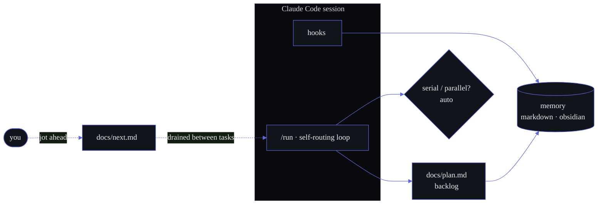
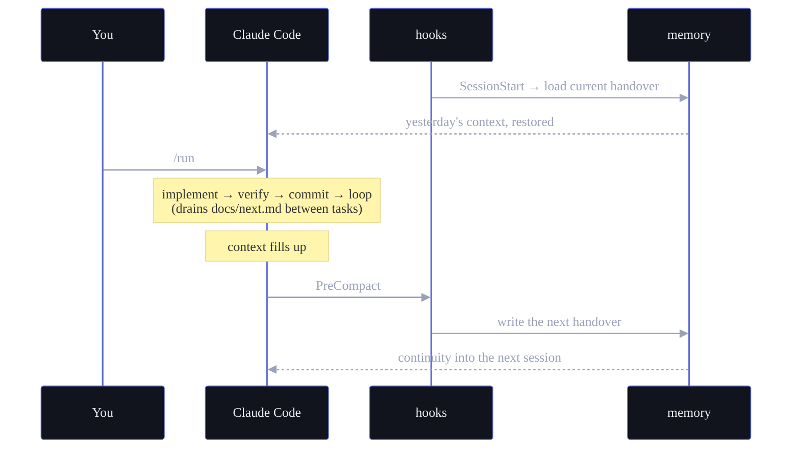

<p>
  <a href="LICENSE"></a>
  
  
  
</p>

**A Claude Code session forgets everything the moment it ends.** iris is the layer that remembers — then keeps working. It writes its own handover before context compaction and loads it at the next session start, runs your backlog end to end (implement → verify → commit → repeat), decides for itself when to parallelize, and lets you queue the next ideas mid-run without breaking stride. Plain files. No daemon. No lock-in.

```bash
git clone https://github.com/sohams25/iris.git ~/Tools/iris
cd <your-project> && bash ~/Tools/iris/setup.sh
```

---

## Three things it does

### 1 · Memory that survives the session

When context compaction fires — or you run `/rollover` — iris writes a handover: standing instructions, open threads, branch state, what changed. Claude writes it; the `SessionStart` hook injects it at the top of the next session. You stop re-explaining your project every morning, and decisions stop evaporating between sessions.

### 2 · A backlog that runs itself

`docs/plan.md` is a YAML backlog. `/run` works it without a babysitter — picks the next task, implements it, runs your verify command, commits on green, and loops. It inspects the work and **routes itself**: one task or shared files run serially; a batch of file-disjoint tasks fans out into parallel waves, with the width chosen automatically. Point it at the backlog and walk away.

### 3 · Plan ahead without stopping it

Jot the next tasks into `docs/next.md` while a run is in flight. The loop folds them into the backlog at the next safe checkpoint — **between tasks, never mid-task** — so your planning and its execution stay in sync without ever colliding.



## How a session flows



## Quickstart

iris installs alongside an existing Claude Code project.

```bash
git clone https://github.com/sohams25/iris.git ~/Tools/iris
cd <your-project>
bash ~/Tools/iris/setup.sh        # symlinks .claude/ + scripts/, copies templates, runs doctor
```

`setup.sh` symlinks `.claude/{commands,hooks,skills}/` and `scripts/` into your project, copies `CLAUDE.md`, `docs/plan.md`, and `docs/next.md` templates if missing, scaffolds `$PROJECTS_DIR/`, generates `.env`, and runs `scripts/doctor.py` (14 health checks). Open a session and try `/status`.

## Commands

| Command | Does |
|---|---|
| `/run` | Work the backlog: drains `docs/next.md`, auto-routes serial vs parallel, verifies + commits each step |
| `/status` | Open tasks · current handover · branch · last commits |
| `/backlog [Tnnn]` | The backlog as a table, or one task by id |
| `/submit <desc>` | Refine a raw idea into a `T###` entry |
| `/rollover [title]` | Write a handover checkpoint now, with carry-forward |
| `/memory [current\|list\|search\|validate]` | Inspect the memory backend |
| `/doctor` | Run the 14 health checks |
| `/new-task <slug>` | Scaffold `$PROJECTS_DIR/<N>_<slug>/` with README + docs/ + archive/ |

> Plan ahead by editing `docs/next.md` directly while `/run` is going — no command needed. `/plan` belongs to Claude Code's built-in plan mode.

## Memory

Two backends, one CLI — switch with `MEMORY_BACKEND` in `.env`.

| Backend | Storage | For |
|---|---|---|
| `markdown` *(default)* | `handovers/handover_NNN.md` at repo root | Zero deps, plain files, grep-friendly, isolated per project |
| `obsidian` | `$OBSIDIAN_VAULT/work/handovers/<project>/` | Handovers searchable inside your vault, namespaced per project |

`scripts/migrate-handovers.py` lifts an existing markdown corpus into a vault, preserving the prev/next chain as `[[wikilinks]]`.

## Run it in every repo at once

iris resolves *repo root* from `$IRIS_ROOT` (else the working directory) on every call, so each project's `handovers/`, `.iris-state/`, `docs/plan.md`, and `docs/next.md` live under that project. Open a session in repo A and another in repo B — handovers, run locks, and backlogs never cross. The obsidian backend namespaces handovers per project under `work/handovers/<project>/`; the markdown default needs no configuration. `tests/test_multiproject_isolation.py` pins both.

## Integrations

iris's core has no idea Slack exists — it just exposes `scripts/*.py` and the slash commands. An adapter under `integrations/<name>/` wraps those for its medium, so the same loop can drive your team's chat.

```
integrations/
├── slack/      # reference adapter — ships
├── discord/    # documented stub
└── webhook/    # documented stub
```

Copy `integrations/slack/` to `integrations/<name>/`, retarget its sender/receiver, add an env stub. See `docs/integrations.md` for a worked example.

## Under the hood

```
iris/
├── .claude/
│   ├── commands/   · 8 slash commands
│   ├── hooks/      · session-start · pre-compact · block-ai-trailers
│   ├── skills/     · handovers · swarm (parallel engine) · commit-style · karpathy-guidelines
│   └── settings.json
├── scripts/
│   ├── _iris_paths.py     · shared repo-root resolution (the multi-project core)
│   ├── memory.py          · CLI over both memory backends
│   ├── queue.py           · plan-ahead queue: drains docs/next.md → backlog
│   ├── build-wave-plan.py · the serial/parallel router (--decide), auto width
│   ├── parse-tasks.py · doctor.py (14 checks) · handover-new/validate · migrate-handovers
│   └── notify.py · detect-verify.sh · slackbot-start.sh
├── integrations/  · slack (ships) · discord · webhook (stubs)
├── tests/         · primitives · hooks · adapters · multi-project · skills · queue · router
├── docs/          · plan.md · next.md · integrations.md · architecture.md
└── setup.sh · CLAUDE.md · Makefile · pyproject.toml
```

`/run`'s parallel engine is the `swarm` skill; `build-wave-plan.py --decide` is what chooses to call it.

## Why "iris"

The eye's aperture that opens to let the light in, and the Greek goddess who carried messages between worlds. iris keeps your session in focus and moves what matters between it and everything around it — your terminal, your past sessions, your backlog.

## License

MIT — see [LICENSE](LICENSE).

## Acknowledgements

- [andrej-karpathy-skills](https://github.com/multica-ai/andrej-karpathy-skills) — MIT; the `karpathy-guidelines` skill is vendored from it.
- [obsidian-mind](https://github.com/obra/obsidian-mind) — the vault format the obsidian backend writes against.
- [superpowers](https://github.com/obra/superpowers) · [stop-slop](https://github.com/hardikpandya/stop-slop) — skills iris links in when present.
- [Claude Code](https://docs.anthropic.com/claude/claude-code) — the host. iris is plumbing; the agent does the work.
