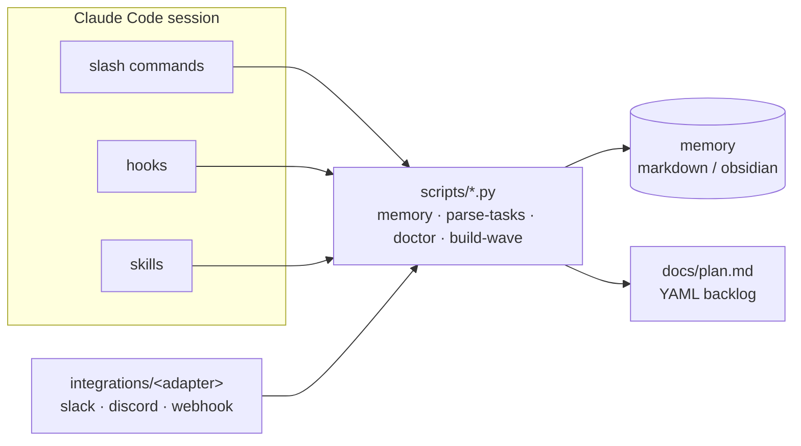
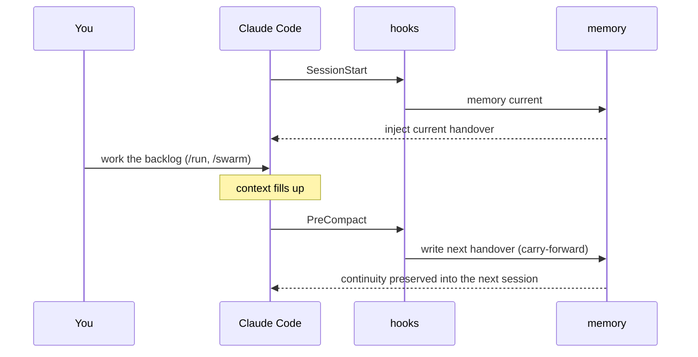
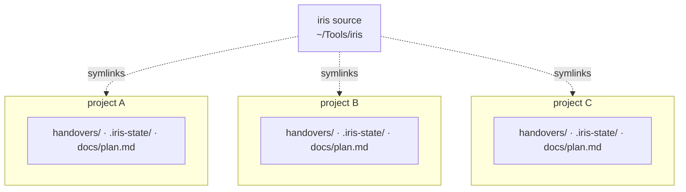

<div align="center">


<p>
  <a href="LICENSE"></a>
  
  
  
  
  <a href="https://github.com/sohams25/iris/actions/workflows/ci.yml"></a>
  
</p>

<strong>Persistent memory, backlog-driven execution, parallel swarms, and a connect-to-anything integration layer — dropped into any Claude Code project.</strong>

<sub><a href="#quickstart">Quickstart</a> · <a href="#commands">Commands</a> · <a href="#memory-backends">Memory</a> · <a href="#work-many-projects-at-once">Multi-project</a> · <a href="#integrations--the-connect-to-anything-model">Integrations</a> · <a href="#skills">Skills</a></sub>

</div>

---

iris is the connective tissue between a Claude Code session and everything
around it — your past sessions, your backlog, your terminal, your team's
chat. Slash commands drive the work, hooks load and save context
automatically, and a small set of dependency-free Python scripts do the
deterministic parts. No daemon. No lock-in. Plain files you can grep.

## Architecture



## What it gives you

| Feature | How |
|---|---|
| **Memory across sessions** | A handover file is written automatically when context compaction fires. The `SessionStart` hook loads the current handover at the top of every new session. |
| **Backlog-driven execution** | `docs/plan.md` is YAML-front-matter. `/run` works it serially (one task → verify → commit → loop). `/swarm` fans file-disjoint tasks across parallel Agent-tool waves. |
| **Commit-message guard** | A `PreToolUse(Bash)` hook blocks `git commit` messages containing `🤖 Generated with Claude Code`, `Co-Authored-By: Claude`, and similar AI footers. Backed by a `commit-style` skill that documents the voice. |
| **Multi-project by default** | Every script roots its state at the project you're in. Run iris in as many repos as you like, simultaneously — handovers, locks, and backlogs never cross. |
| **Connect-to-anything** | An adapter shape under `integrations/<name>/`. Slack ships as the reference adapter. Discord, webhook, and email are documented stubs. |
| **Doctor** | `scripts/doctor.py` runs 14 health checks (CLI present, plan valid, hooks executable, settings.json valid, skill symlinks resolve, etc.) and exits 0/1 — wireable to CI. |

## Quickstart

iris lives alongside an existing Claude Code project. Pick the project you
want to add it to.

```bash
git clone https://github.com/sohams25/iris.git ~/Tools/iris
cd <your-project>
bash ~/Tools/iris/setup.sh
```

`setup.sh` does this:

1. Symlinks `.claude/{commands,hooks,skills}/` and `scripts/` into your
   project. The plugin surface is owned by iris; your project owns its own
   `CLAUDE.md` and `docs/plan.md` (templates copied if missing).
2. Generates `.env` from `.env.example` and scaffolds `$PROJECTS_DIR/`.
3. Offers to install [superpowers](https://github.com/obra/superpowers) and
   [stop-slop](https://github.com/hardikpandya/stop-slop) as `~/Tools/<name>/`
   clones and symlink their skills in.
4. Runs `python3 scripts/doctor.py` and prints the verdict.

Open a Claude Code session in the project; `/status` confirms the install.

## How a session flows



## Commands

| Command | What it does |
|---|---|
| `/status` | Snapshot: open tasks, current handover, branch, last commits |
| `/backlog [Tnnn]` | Full backlog table; optionally one task by id |
| `/submit <desc>` | Refine a raw description into a `T###` entry in `docs/plan.md` |
| `/run` | Serial loop: next task → implement → verify → commit → loop |
| `/swarm` | Parallel-wave execution via the Agent tool (file-disjoint tasks only) |
| `/rollover [title]` | Manual handover checkpoint with carry-forward |
| `/memory [current\|list\|search\|validate]` | Inspect the memory backend |
| `/doctor` | Run the 14 health checks |
| `/new-task <slug>` | Scaffold `$PROJECTS_DIR/<N>_<slug>/` with template README + docs/ + archive/ |

`/plan` is reserved by Claude Code's built-in plan mode. Use `/backlog`.

## Hooks

| Event | Script | What it does |
|---|---|---|
| `SessionStart` | `.claude/hooks/session-start.sh` | Reads `memory.py current` and injects the handover body as a `## iris context` block |
| `PreCompact` | `.claude/hooks/pre-compact.sh` | Auto-runs `/rollover` semantics. Writes a new handover before Claude compacts. |
| `PreToolUse(Bash)` | `.claude/hooks/block-ai-commit-trailers.sh` | Blocks `git commit` whose message body contains an AI signature. Fails open on any malformed input. |

All three are wrapped so they never block a session if the underlying script
breaks.

## Memory backends

| Backend | Storage | When to use |
|---|---|---|
| `markdown` (default) | `handovers/handover_NNN.md` at repo root | Zero external deps. Plain files. Easy to grep. Isolated per project. |
| `obsidian` | `$OBSIDIAN_VAULT/work/handovers/<project>/<date>__<slug>.md` | You already use Obsidian and want handovers searchable from your vault. |

Switch via `MEMORY_BACKEND` in `.env`. `scripts/migrate-handovers.py` moves an
existing markdown corpus into a vault, preserving the prev/next chain via
`[[wikilinks]]`.

## Work many projects at once

iris resolves "repo root" from `$IRIS_ROOT` (else the current working
directory) on every call, so each project's `handovers/`, `.iris-state/`
(event log + `run.lock`), and `docs/plan.md` are rooted at *that* project.
Open a session in repo A and another in repo B and they never touch each
other's state.



The obsidian backend shares one vault, so it namespaces each project under
`work/handovers/<project>/` (the project directory name, or `$IRIS_PROJECT`
to disambiguate same-named repos). The markdown default needs no
configuration. `tests/test_multiproject_isolation.py` pins both.

## Integrations — the connect-to-anything model

```
integrations/
├── slack/       # reference adapter (ships)
├── discord/     # documented stub
├── webhook/     # documented stub
└── README.md    # adapter contract
```

Each adapter is a small Python package with a `start()` entry point and its
own env-var contract. The core has no idea Slack exists — it just exposes
`scripts/memory.py`, `scripts/parse-tasks.py`, and the slash commands. An
adapter wraps those for its medium.

To add one, copy `integrations/slack/` to `integrations/<your-name>/`,
retarget its sender/receiver, and add the env-var stub to `.env.example`. See
`integrations/README.md` for the contract and `docs/integrations.md` for a
worked example.

## Skills

Four skills are owned by iris and symlinked into every project by `setup.sh`:

| Skill | Purpose |
|---|---|
| `handovers` | The handover frontmatter contract and writing rules. |
| `swarm` | The parallel-wave execution protocol. |
| `commit-style` | Human-voice commit messages; forbids AI footers. |
| `karpathy-guidelines` | Behavioral coding guidelines — think before coding, simplicity first, surgical changes, goal-driven execution. Vendored from [multica-ai/andrej-karpathy-skills](https://github.com/multica-ai/andrej-karpathy-skills) (MIT). |

`setup.sh` can also symlink in [superpowers](https://github.com/obra/superpowers)
and [stop-slop](https://github.com/hardikpandya/stop-slop) if you install them.

## Layout

```
iris/
├── .claude/
│   ├── commands/     # slash commands (9 files)
│   ├── hooks/        # 3 hooks: session-start, pre-compact, block-ai-trailers
│   ├── skills/       # 4 owned skills: handovers, swarm, commit-style, karpathy-guidelines
│   └── settings.json # hook wiring
├── scripts/
│   ├── _iris_paths.py # shared repo-root resolution (the multi-project core)
│   ├── memory.py      # CLI over the memory backends
│   ├── doctor.py      # 14 health checks
│   ├── parse-tasks.py # YAML backlog parser
│   ├── handover-new.py + handover-validate.py
│   ├── migrate-handovers.py
│   ├── build-wave-plan.py  # swarm-wave dependency planner
│   ├── notify.py + notify-slack.sh
│   ├── detect-verify.sh    # auto-detect the verify command
│   └── slackbot-start.sh
├── integrations/
│   ├── slack/        # the reference adapter
│   ├── discord/      # stub
│   └── webhook/      # stub
├── tests/            # pytest — primitives, hooks, adapters, multi-project, skills
├── assets/           # README banner
├── docs/
│   ├── plan.md             # template backlog
│   ├── integrations.md     # adapter authoring guide
│   └── architecture.md     # how the pieces fit
├── .env.example
├── CLAUDE.md         # the agent guide
├── setup.sh          # one-command install into a target project
├── Makefile
├── pyproject.toml
└── README.md
```

## Why iris?

Greek messenger goddess. The rainbow bridge between worlds — between your
Claude session and your terminal, your handovers and your future sessions,
your backlog and your team's chat. The "connect to anything" brief made the
name pick itself.

## License

MIT. See [LICENSE](LICENSE).

## Acknowledgements

- [andrej-karpathy-skills](https://github.com/multica-ai/andrej-karpathy-skills)
  — MIT; the `karpathy-guidelines` skill is vendored from it, derived from
  [Andrej Karpathy's observations](https://x.com/karpathy/status/2015883857489522876)
  on LLM coding pitfalls.
- [obsidian-mind](https://github.com/obra/obsidian-mind) — the vault format
  the obsidian memory backend writes against.
- [superpowers](https://github.com/obra/superpowers) — skills iris symlinks in
  if you install them.
- [stop-slop](https://github.com/hardikpandya/stop-slop) — MIT; iris's
  `commit-style` skill defers to it on prose voice.
- [Claude Code](https://docs.anthropic.com/claude/claude-code) — the host.
  iris is just plumbing; the agent does the work.
